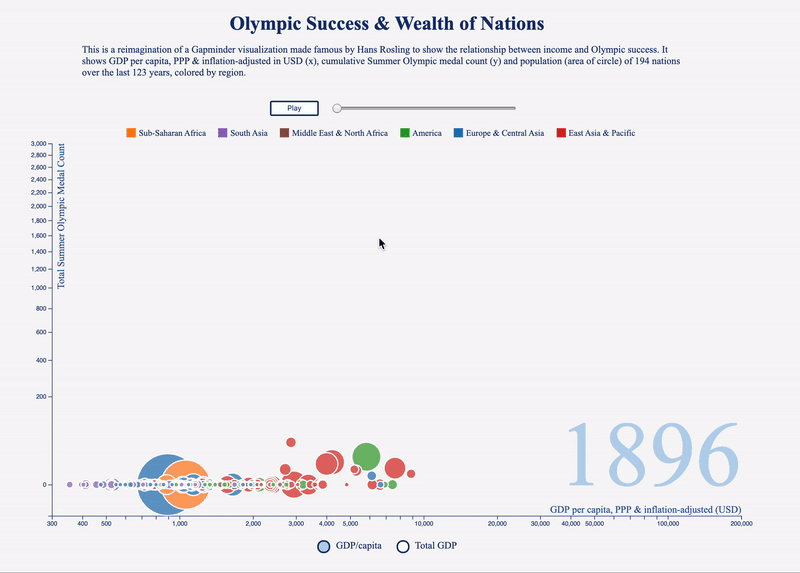

# Olympic Success & Wealth of Nations

Interactive bubble chart of relationship between Olympic success and GDP of nations since the start of the Modern Olympics. A reimagination of Gapminder's Wealth & Health of Nations.

[Live Link](https://ed-xiao.github.io/olympics/ "Olympic Success")

# Background
Data visualization on the relationship of GDP and Olympic success through an interactive bubble chart with the below dimensions:
* x-axis: GDP
* y-axis: total number of summer Olympic medals
* size of bubbles: population
* color: region
* the circles on the chart will adjust accordingly by year

# Technical Implementation
* See country data visualized by GDP, Olympic medals, population, continent.
* Drag a bar to change the chart over time (1900-current).
* Be able to click play for time to elapse automatically.
* On hover of nation bubble, show specific GDP and medal count (maybe other olympic data).

# Architecture and Technologies
* HTML, CSS, JS, D3.js
* Data sourced from: Gapminder, Wikipedia

# Future Features
* On hover show a greyed out path for the country over the entire timeline of the chart
* Have a sidebar of checkboxes to filter the chart by categories (country, continent, sporting event, etc.)
* Add additional data points for x-axis and y-axis (winter olympic medals)